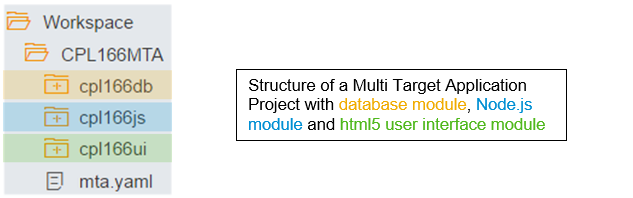

# Tutorial: Develop Locally with SAP HANA, Express Edition, and Deploy to Cloud Foundry

## Scenario Overview
With SAP HANA 1 SPS 11, SAP has introduced a major new application server architecture: Extended Application Services for SAP HANA, advanced model (XS Advanced) on premise. This architecture is based on Cloud Foundry, which is now also available in SAP Cloud Platform. In this session, you are going develop an application using SAP HANA, express edition, and SAP Web IDE locally; then deploy the application to Cloud Foundry with SAP HANA on SAP Cloud Platform. The application will be built using Microservices and leverages the powerful HANA database capabilities in combination with flexible and scalable cloud concepts. 

With the programming model of XS Advanced you are not bound to a specific programming language. The platform itself can be extended with support for a broad variety of languages – just like in Cloud Foundry. In our scenario, we will focus on HANA database development, application logic using JavaScript and Node.js plus a User Interface using SAPUI5 backed by an OData Service you will expose. 
To introduce security aspects in your application, we will make use of the User Authorization and Authentication backing service (UAA) available on both XS Advanced and Cloud Foundry. 

To ensure proper configuration and deployment of the services we are going to develop, we will use the Multi Target Application descriptor (mta.yaml) - a platform independent description of the different application modules, their interdependencies and configuration data they expose, and the resources they require to run. Using this descriptor, it is ensured that the application can be deployed on both XS Advanced on premise systems and Cloud Foundry. 
 
  
## In this tutorial you will learn:
<li> to create Multi Target Application projects in SAP WebIDE
<li>to create HANA database artifacts using HANA Deployment Infrastructure and Core Data Services
<li> to create HANA business logic using SQL procedures
<li> to create business logic using Node.js
<li> to build a user interface backed by an OData service
<li> to use the UAA backing service to ensure security for your application
<li> build your application and deploy to Cloud Foundry

## Exercises
Exercise 1: Create Project and Database Artifacts 
In this exercise, you will use SAP Web IDE on HANA to create a Multi Target Application Project with a database module.  
Start right away with [Exercise1](./exercise1/README.md)
  
Exercise 2: Adding Business Logic with JavaScript 
In this exercise, you will create and test a Node.js module with additional business logic and expose an OData service which we can consume in a user interface later. 
Start right away with [Exercise2](./exercise2/README.md)
  
Exercise 3: Adding a User Interface 
In this exercise, you will create and test the user interface for your application by using the OData service we created during exercise 2 in SAPUI5. 
Start right away with [Exercise3](./exercise3/README.md)
  
Exercise 4: Adding Authentication and Authorization to your Application 
In this exercise, you will add authentication and authorization using the UAA service. Authentication forces users to log on and identify themselves, before they can use the application. You will also add authorization checking code to introduce two categories of users. 
Start right away with [Exercise4](./exercise4/README.md)
  
Exercise 5: Deploying your Multi-Target Application to Cloud Platform 
In this exercise, you will create the MTA archive as the deployable unit using the SAP Web IDE export functionality and deploy it to the Cloud Platform trial landscape using the Cloud Foundry command line tool. 
Start right away with [Exercise5](./exercise5/README.md)
