### CPL166 
# Exercise 1 - Create Project and Database Artifacts

## Step 0 - Log on to your trial account of the Cloud Foundry environment
Log on to the SAP Cloud Platform cockpit of your trail account using the cockpit URL [https://account.hanatrial.ondemand.com](https://account.hanatrial.ondemand.com), the Email 'cpl166-NNN@teched.cloud.sap' (replace 'NNN' with the number provided on your table) and password 'Welcome17'. Then, on the 'Home' level, click on 'Go to Cloud Foundry Trial'. Navigate to your subaccount 'trial'. Click on 'Spaces' in the left navigation pane. Navigate to the your space 'dev'. Once applications are deployed they will be visible there.

## Step 1 - Create the Project
Launch SAP Web IDE for SAP HANA by launching the URL [https://wdflbmt0749.wdf.sap.corp:53075/](https://wdflbmt0749.wdf.sap.corp:53075/) in Google Chrome. Login with the User: `CPL166` and Password: `Sap12345`.

An application is created in the context of a _project_. In this session we will start completely from scratch. Therefore, a new project needs to be created by clicking on "File" -> "New" -> "Project from Template".

 
<br><br>

This will open a new dialog where a _project template_ can be selected. Select the template "Multi-Target Application Project" and click on the "Next" button. On the next page enter the project name 'CPL166MTA' and click "Next". 

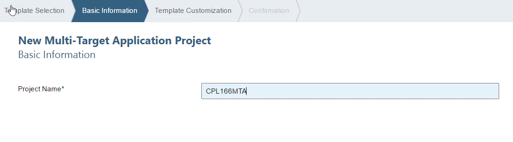 
<br><br>

In the next step make sure to select `DEV` as the space and then finish the wizard.

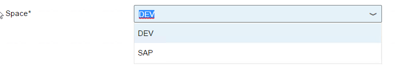 
<br><br>

This will now create the project structure in your workspace.

 
<br><br>

Now that we have an empty application project, we can add our first module which will contain the database part of the application.
This module can be created by right-clicking on the project folder in the workspace (name `CPL166MTA`) and selecting "New" -> "SAP HANA Database Module".
You might need to click on 'More...' to see this option.

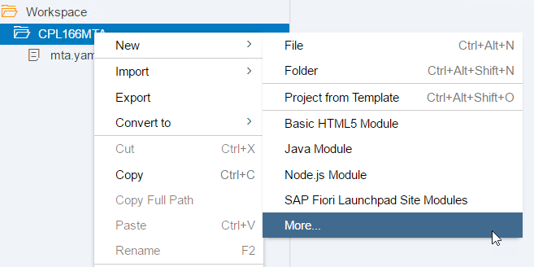 
  <br><br>
  
In the dialog enter the name of the module `cpl166db`. In the next wizard step make sure to select HANA Database Version 2.0 SPS00! This is required because there is no newer Version available in the Cloud Foundry Trial yet.

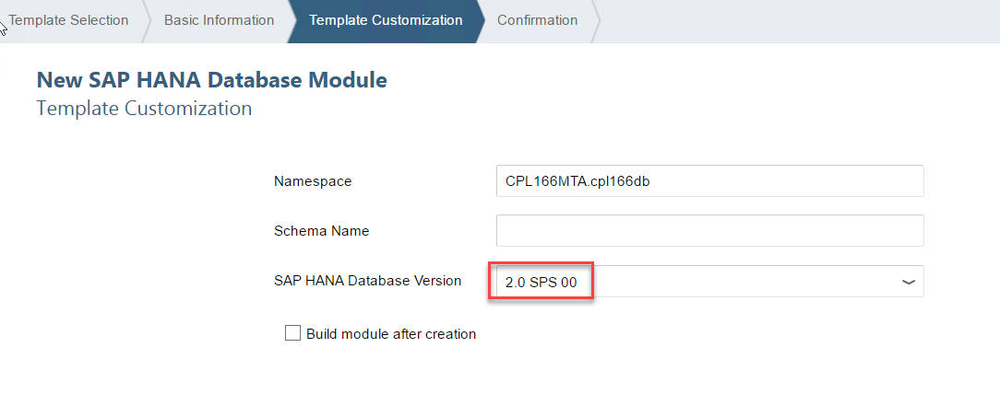 
<br>
  <hr><br>
    
## Step 2 - Adding basic database content

In this step we will now add some basic database content. Therefor we use CDS, an SAP enhancement to SQL for defining and consuming semantically rich data models. 
To create a CDS file, navigate to the `src/` subfolder of the `cpl166db` module, right-click it and select "New" -> "CDS Artifact".

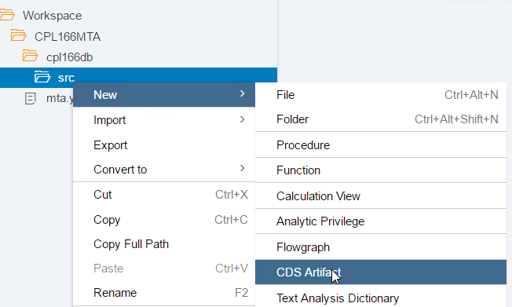 
<br><br>

In the upcoming dialoge, enter the name `cpl166f`, set "Open With" to "Text Editor" and create the file. 

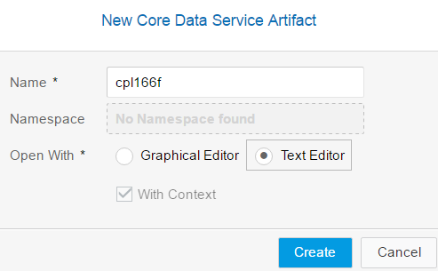 
<br><br>

The text-editor for CDS files will open.  
Inside of the file we will define two entities, `world` and `country` and the relationship between those. 
The first entity 'world' will be defined in the text editor as follows:


```
namespace CPL166MTA.cpl166db;

context cpl166f {
    entity world {
        key continent : String(100);
    }
};

```
<br><br>
After this, we will create the second entity using the graphical CDS editor, so that you also experience the usage of that. Open the graphical editor by right-clicking on the file `cpl166f.hdbcds` and selecting "Open With" -> "Graphical Editor":

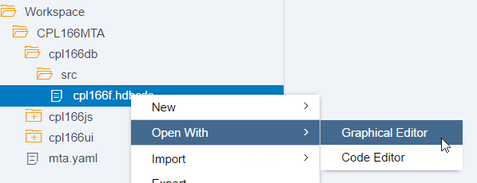  
<br><br>
Now add a new entity by clicking on the respective icon. Place it by moving the mouse on the canvas and left-clicking to complete. Now enter the name `country`. All the names here are case sensitive, so please pay attention, that you are always using the same case.

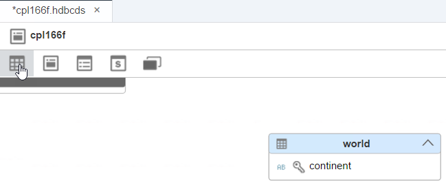  
<br><br>

Open the details view by double-clicking on `country`. Now add a new element by clicking on the '+' icon. Name the element `name` and select the type `String` with a length of 100. Tick the `key` checkbox to set the name as key.

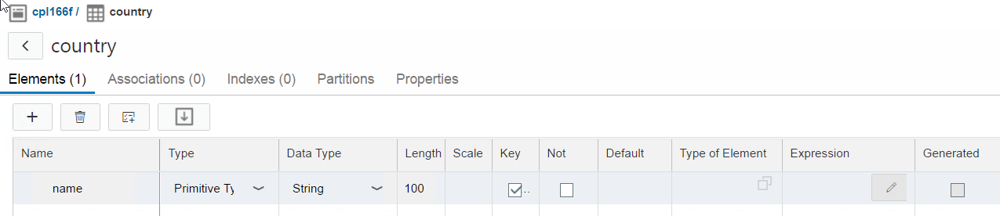  
<br><br>

To model the relationship of the entities `country` and `world` switch to the 'Associations' tab and add a new association. Enter `partof` as name, select the Target Cardinality [0..1], Target Entity `world` and the Association Type `Managed`. Save the file by pressing CRTL+S and close the detail view by clicking on the `<` icon on the top-left.  

  
<br><br>

The graphic will now show the new entity and the association (depicted by the arrow connecting the entities).  

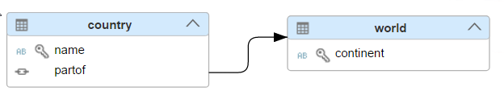  
<br><br>

If you close the file and re-open it in the code editor, it will show the following content:  

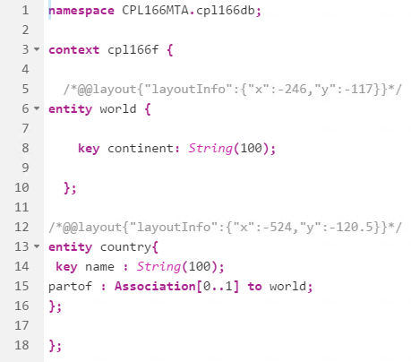  
<br><br>

Now select the `cpl166db` module, right-click and select "Build". This starts the build process which also creates the database artifacts required for the next steps.

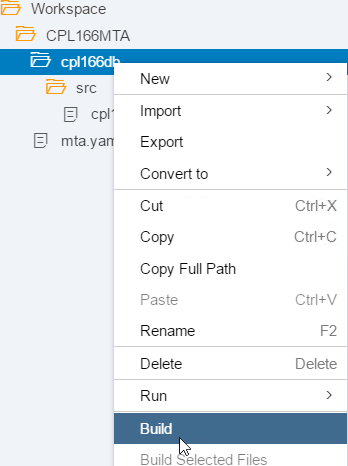  
<br><hr><br>

## Step 3 - Using analytic capabilities to show European countries only

In this step we will leverage the analytic capabilities of SAP HANA to create a view that only shows the countries of the continent Europe.
We will use the SAP HANA modeler to graphically create a Calculation View.

To create a Calculation View, navigate to the `src/` subfolder of the `cpl166db` module, right-click and select "New" -> "Calculation View". In the upcoming wizard, enter the name `european_countries` and select the data category "Dimension". Then click "Create". 

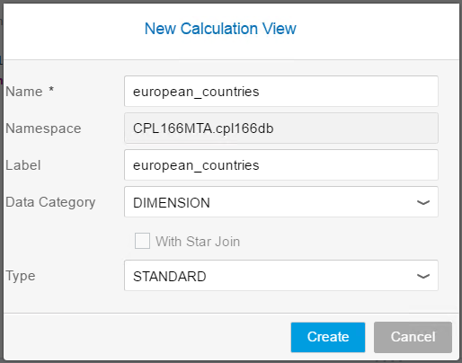  
<br><br>

This will open the graphical editor for Calculation Views.

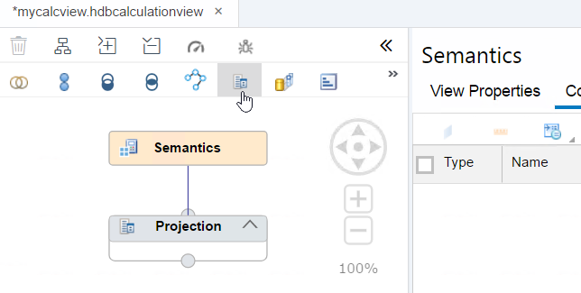  
<br><br>

First, we will add a second projection underneath the already existing one. This can be done by clicking the respective icon in  the toolbar. To place the projection, move the mouse to a an empty space below the existing projection on the canvas. Then use a left-click to create the new projection node at the current position. Then draw a relation by using the arrow button which is visible when you select the new projection (hold the mouse button on the arrow button and drag the connection to the other projection).

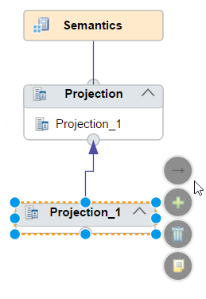  
<br><br>

In order to show the results for European countries only, we need to edit the newly created projection. Therefore select the `projection_1` node and click on the `+` icon on the "Mapping" tab on the right side of the editor. A search wizard appears.

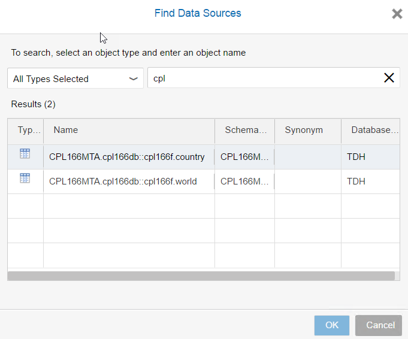  
<br><br>

Now we need to select the `country` entity from the previous step. To to so, enter the search term "cpl". From the result, select `CPL166MTA.cpl166db::cpl166f.country` and click on "Ok".
Now we need to _connect_ the "Data Sources" to the "Output Columns": select the table and click on the "Add to Output" icon.

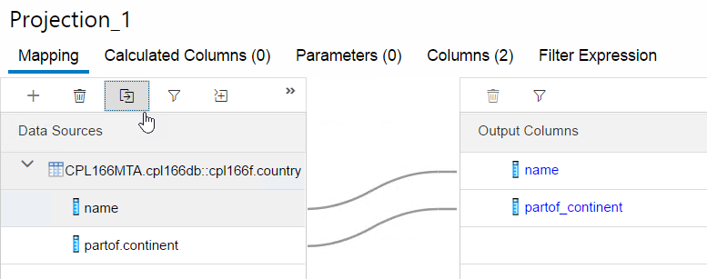  
<br><br>

With the Data Sources connected, we need to create a "Filter Expression" to filter for countries in Europe. Navigate to the respective tab, open the "Columns" element and then double-click on `partof_continent`. In the operators selector click on the `=` button. The expression will appear at the top; complete it by typing ```'Europe'```.

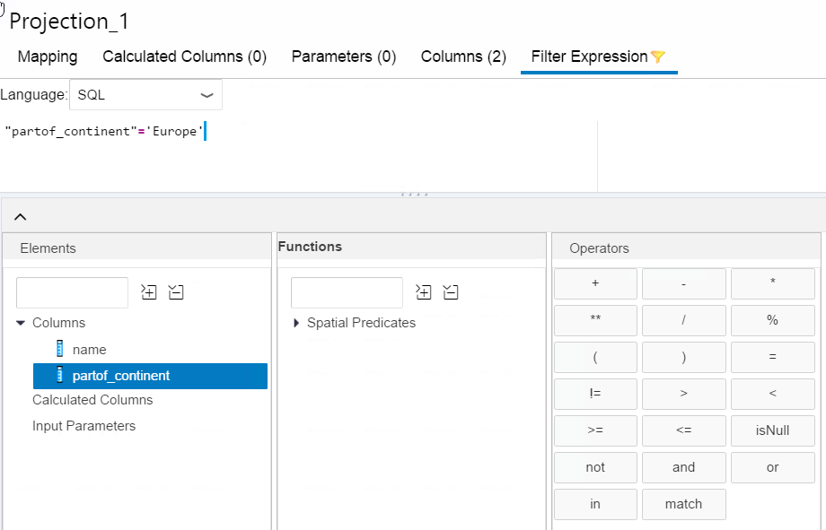  
<br><br>

Next, select the `Projection` node on the left, and in its `Mapping` tab, select and drag `name` from "Data Sources" to "Output Columns" with your mouse.   

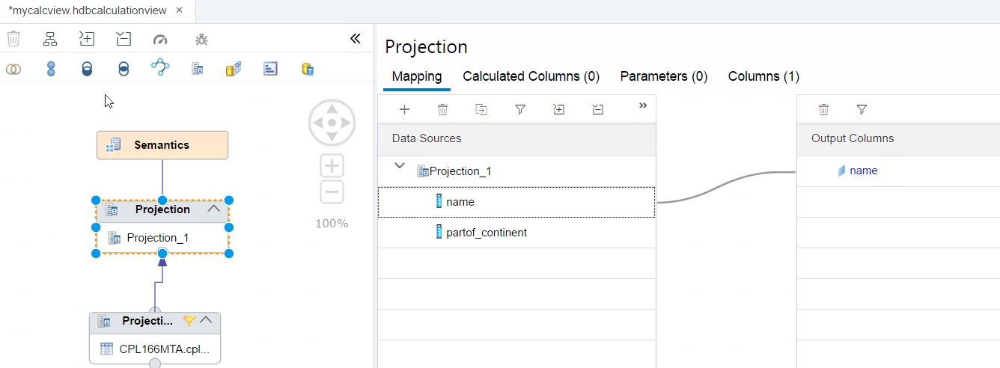  
<br><br>

Finally save the Calculation View by pressing CTRL+S or pressing the save button.
  
  <br><hr><br>
## Step 4 - Adding SAP HANA business logic to insert new countries

To ease the creation of new countries, we will create a stored procedure written in SQLScript.  
This procedure will take two import parameters for the continent and country, validate them and enter the values into the database if they are correct. If not, a meaningful error message will be returned.
  
A stored procedure can be created by right-clicking on the `src` folder inside the `cpl166db` module and selecting "New" -> "Procedure".  
We call our new procedure `createCountry`. Add the following content and save the file by pressing CTRL+S.

```
PROCEDURE "CPL166MTA.cpl166db::createCountry" ( 
	IN im_country NVARCHAR(100), im_continent NVARCHAR(100),
	OUT ex_error NVARCHAR(100)
	)
   LANGUAGE SQLSCRIPT
   SQL SECURITY INVOKER
   
   AS
BEGIN
   /*************************************
       Write your procedure logic 
   *************************************/
  
  declare noc integer;
  
      select count(*) into noc from "CPL166MTA.cpl166db::cpl166f.world" where "continent" = im_continent;
  
	if :noc = 0 then
		insert into "CPL166MTA.cpl166db::cpl166f.world" values ( im_continent);
	end if;  
	select count(*) into noc from "CPL166MTA.cpl166db::cpl166f.country" where "name" = im_country;
		
	if :noc > 0 then
		ex_error := 'ERROR: Country ' || :im_country || ' already exists!';
	else
		insert into "CPL166MTA.cpl166db::cpl166f.country" values (im_country, im_continent);
	end if;  
END
```

<br><hr><br>
## Step 5 - Build the database module

To create the runtime database artifacts from the design-time specification, we need to build the database module.  
Select the `cpl166db` module, right-click and select "Build". This starts the build process.  


  
<br><br>

After a short time you will see the success message on the console. If an error occurred during the build, it will also be shown in this console.

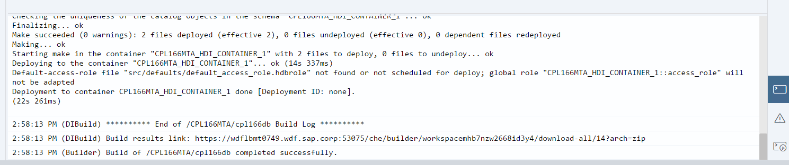  
<br><hr><br>

## Step 6 - Insert content

To use our created artifacts, we will now add some content.  
Therefore, we switch to the "Database Explorer" perspective of the WebIDE by clicking on the respective icon in the left sidebar (the second one). <br> 
If no databases have been added to the Database Explorer yet, a dialog will prompt you to do so. In the "Add Database" dialog, search for `cpl166db`, select the found container and click `ok` to add it.<br>
The upper part of the left-hand UI column shows the available HDI containers. In our case, this will show the container we have built in Step 5.<br>
Expand the container by clicking on the small arrow. The UI shows the contained database artifacts in several categories. Select the "Tables". <br>
In the lower part, the newly created tables `CPL166MTA.cpl166db::cpl166f.world` and `CPL166MTA.cpl166db::cpl166f.countries` are shown.<br>
Now we will insert some data into these tables. Open the SQL Console by clicking on the respective icon in the upper part of the UI.

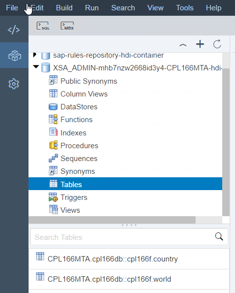  
<br><br>
To insert data, we will use SQL-Insert statements to create the continents and Call statements to create the countries. The SQL-Insert statements can be run together, the Call statements need to be run individually because they contain variables.

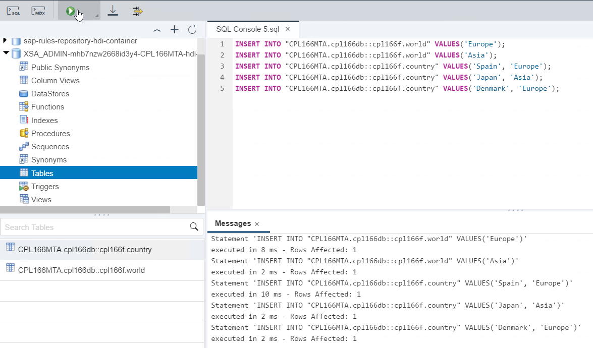  

<br>

```
INSERT INTO "CPL166MTA.cpl166db::cpl166f.world" VALUES('Europe');
INSERT INTO "CPL166MTA.cpl166db::cpl166f.world" VALUES('Asia');


CALL "CPL166MTA.cpl166db::createCountry"('Spain', 'Europe', ?);
CALL "CPL166MTA.cpl166db::createCountry"('Japan', 'Asia', ?);
CALL "CPL166MTA.cpl166db::createCountry"('Denmark', 'Europe', ?);

```


<br><br>

The content of the tables can be checked with a Select statement:   

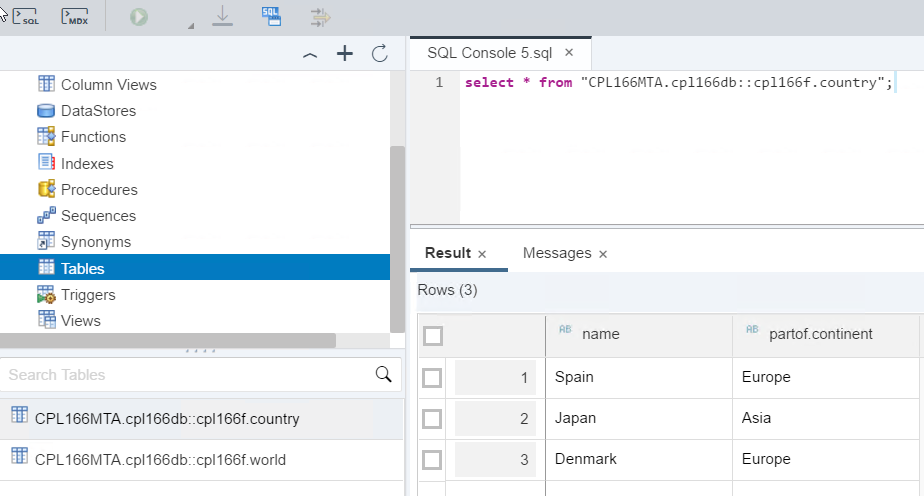  
<br><br>

Continue with [Exercise2](../exercise2/README.md)


