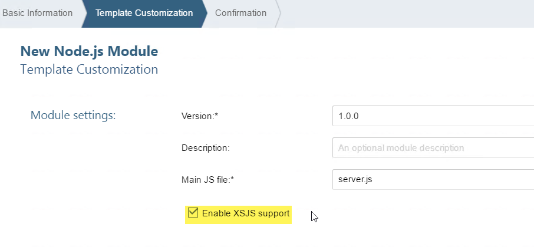
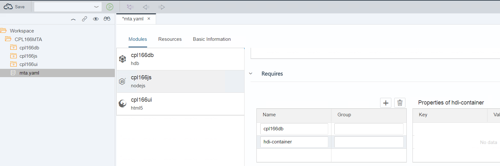
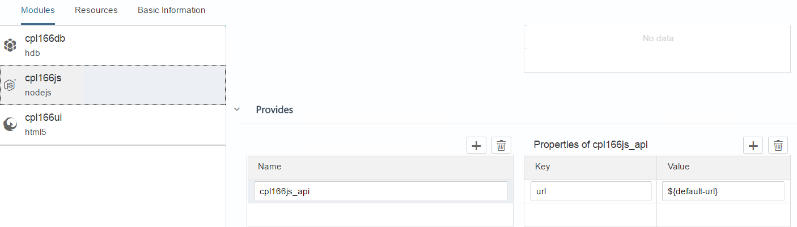
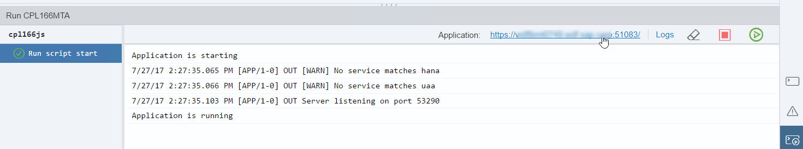
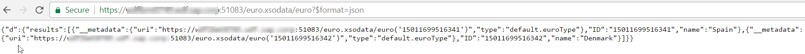
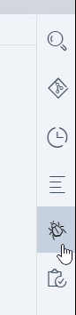
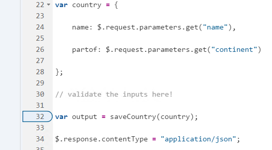

### CPL166
# Exercise 2 - Adding Business Logic with JavaScript
In this exercise we will implement additional application business logic using Node.js. The module we are creating will also expose the data from the HANA database via an automatically generated OData service, which can easily be consumed in SAPUI5 user interfaces later on. The easy support of OData exposition comes with the XSJS library delivered with XS Advanced, which also provides compatibility means for the XS Classic programming model.
<br><hr><br>
## Step 1 - Create a Node.js module
1. Right-click on the CPL166MTA project and select "New" -> "Node.js module". 
1. Call it `cpl166js` 
1. Check the  "Enable XSJS support" checkbox. This is required to make use of the OData provisioning capabilities via the XSJS library.
<br><br>
 
<br><br>
The setup wizard creates the new Node.js module which contains a number of default folders and files, for example, the file `lib/index.xsjs` with simple "Hello World" code. It would be runnable already, but we will keep that for later after doing some real coding. The module is also automatically added to our application descriptor `mta.yaml`.

<br><hr><br>
## Step 2 - Creating and exposing a new OData service
1. In your workspace right-click on the `cpl166js/lib` folder and create a new file called `euro.xsodata`. Using this suffix will enable the file to define OData services via declarative syntax. Add the following content to this file
```
service {
  "CPL166MTA.cpl166db::european_countries" as "euro" keys generate local "ID";
}
``` 
2. Then save the file.<br>
This will define a service named `euro.xsodata` with an entity called `euro`, based on the `european_countries` Calculation View we have defined in exercise 1. The entity `euro` uses an auto-generated key called `ID`.
Before we can test the service, we have to define a dependency from the Node.js module to the database module.
3. Open the MTA editor by double-clicking on `mta.yaml` in the project root folder and select the `cpl166js` module.<br>
4. Go to the "Requires" section and add the dependencies to `cpl166db` and `hdi-container` (if this is not available it might be called `hdi_cpl166db`)
<br><br>
 
<br><br>
We will also review necessary parameters to expose the service.<br> 
5. Therefore go to the "Provides" section and check that `cpl166js_api` with a property called `url` and the value `${default-url}` is there, which is automatically generated in case XSJS support is enabled for the module.
<br><br>
 
<br><br>
6. Don't forget to save your changes. You may also review what happened in the mta.yaml using the text based editor now.
<br><hr><br>

## Step 3 - Testing the OData service
1. Open the file `cpl166js/package.json` and update the version dependency for @sap/xsjs to version "1.14.1" if it is smaller. Then save the file.
1. Right-click on the module `cpl166js` and choose  "Run" -> "Run as Node.js Application"  in the context menu. The command automatically builds the application, too. You can view the build/run progress in the run console at the bottom of the SAP Web IDE screen.
1. When the application has started successfully, you will see a link on top of the run console to navigate to it in the browser.
1. Since we did not change the code in application start-up file `index.xsjs`, the Web browser still displays the text "Hello World". However, you can use a modified URL to test the OData service.
Just replace the URL segment `/index.xsjs` after the port number with `/euro.xsodata/euro?$format=json`, which should result in an output like this
<br><br>
 
<br><br>

<br><hr><br>
## Step 4 - Adding business logic with JavaScript
While OData supports create/modify/delete actions to tables, most applications use application logic to validate the input values first. We will do this by writing a JavaScript that receives inputs over a REST interface and writes the (validated) data into the database.
1. Right-click the `cpl166js/lib/` folder, and create a new file with "New" -> "File".  Enter `country/country.xsjs`.
1. Add the following JavaScript code to the file, and save it.

```
function saveCountry(country) {
  var conn = $.hdb.getConnection();
  var output = JSON.stringify(country);
  var fnCreateCountry = conn.loadProcedure("CPL166MTA.cpl166db::createCountry");
  var result = fnCreateCountry({IM_COUNTRY: country.name, IM_CONTINENT: country.partof});
  conn.commit();
  conn.close();

  if (result && result.EX_ERROR != null) { 
    return result.EX_ERROR;
  }
  else { return output; }
}

var country = {
  name: $.request.parameters.get("name"),
  partof: $.request.parameters.get("continent")
};

// validate the inputs here!
var output = saveCountry(country);
$.response.contentType = "application/json";
$.response.setBody(output);
```

The code snippet reads the values of two "GET" parameters, "name" and "continent" respectively, passes them to a function that calls the SQLScript procedure createCountry, which is used to write these values to the 'country' table, and displays a confirmation message.
<br><br><b>Note:</b>
To keep things simple, we uses the HTTP GET method to access the service used to create database entries; productive applications should always use http update methods (for example, POST, PUT, or DELETE) to make changes or modifications to the database.

<br><hr><br>
## Step 5 - Building and testing the Node.js module

1. Right-click on the module `cpl166js` and choose  "Run" -> "Run as Node.js Application"  in the context menu. The command automatically builds the application, too. 
1. As before, you can click on the link which is displayed on top of the Run Console after successful build to start the application in a new browser tab.
1. In your web browser, replace the URL element `/index.xsjs` with the string `/country/country.xsjs?name=China&continent=Asia`. Add some more countries like
```
.../country.xsjs?name=Albania&continent=Europe
.../country.xsjs?name=Sweden&continent=Europe
```

The output should look like this (depending on the browser)
```
{
     "name": "China"
     "partof": "Asia"
}
{
     "name": "Albania"
     "partof": "Europe"
}
{
     "name": "Sweden"
     "partof": "Europe"
}
```

<br><hr><br>
## Step 6 - Debugging the Node.js module (Optional)
The built-in debugger in Web IDE enables you to perform standard debugging tasks, such as adding breakpoints to the code and starting, stepping through, and resuming code execution. You can also inspect variables and check the validity of expressions.
1. In the previous step we already started the application. If you stopped it, do "Run" -> "Run as" -> "Node.js Application"<br>
2. Choose "View" -> "Debugger" in the tool bar or click on the bug symbol on the right pane, to display the built-in JavaScript debugging tools.
<br>
 
<br>
3. Choose  (attach) in the debugger pane and select your running Node.js application in the dialog.<br>
4. Set a breakpoint in `country.xsjs` at the line where saveCountry is called
<br><br>
 
<br><br>
5. Now use a new browser tab to insert a new country like ".../country.xsjs?name=Andorra&continent=Europe"<br>
6. In the debug tool you can examine the call stack and see the value assigned to any variable in the function "saveCountry". If you want to modify variables in the context of the current breakpoint, you can use the Debug Console to type in any valid JavaScript statement, including variable assignments. Feel free to experiment with the debug controls.<br>
7. Choose "Resume" to complete execution of the JavaScript

<br><br>
Continue with [Exercise 3](../exercise3/README.md)
