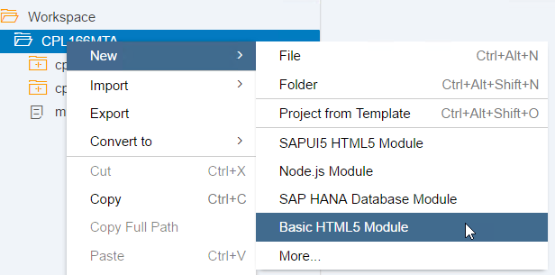
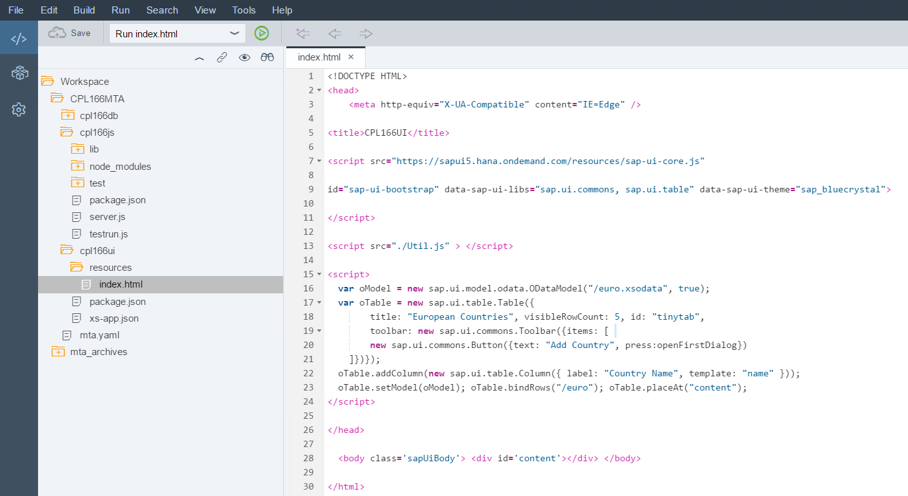
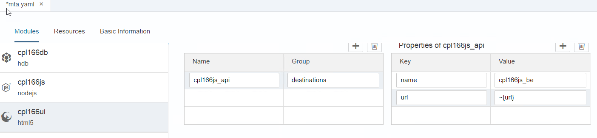
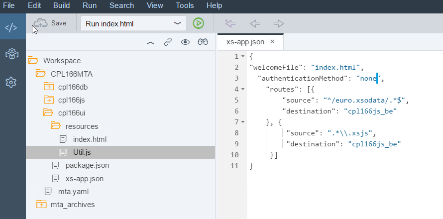
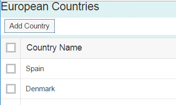

### CPL166 
# Exercise 3 - Building the User Interface for your Application
We now have prepared the database module and business logic of our Multi Target Application and we exposed an OData service via the node.js module, which will return the data stored in the HANA database. Goal of this exercise is to consume the service in a very basic SAPUI5 user interface by using the OData Model.
<br><hr><br>
## Step 1 - Create a new HTML5 Module
* Create a new HTML5 Module via the template Wizard. Right click on the Project and select "New" -> "Basic HTML5 Module".
<br>

<br>

* Call it `cpl166ui` and complete the wizard to generate the module. 
* Now navigate into the `resources` folder and open the `index.html` file.
* Replace the content with the following code:

```
<!DOCTYPE HTML>
<head>
	<meta http-equiv="X-UA-Compatible" content="IE=Edge" />

<title>CPL166UI</title>

<script src="https://sapui5.hana.ondemand.com/resources/sap-ui-core.js"

id="sap-ui-bootstrap" data-sap-ui-libs="sap.ui.commons, sap.ui.table" data-sap-ui-theme="sap_bluecrystal">

</script>

<script src="./Util.js" > </script>

<script>
  var oModel = new sap.ui.model.odata.ODataModel("/euro.xsodata", true);
  var oTable = new sap.ui.table.Table({
		title: "European Countries", visibleRowCount: 5, id: "tinytab",
		toolbar: new sap.ui.commons.Toolbar({items: [ 
		new sap.ui.commons.Button({text: "Add Country", press:openFirstDialog})
	]})});
  oTable.addColumn(new sap.ui.table.Column({ label: "Country Name", template: "name" }));
  oTable.setModel(oModel); oTable.bindRows("/euro"); oTable.placeAt("content");
</script>

</head>

  <body class='sapUiBody'> <div id='content'></div> </body>
 
</html>
```
 
<br>
 
<br><br>
The UI will display all european countries as exposed by our OData service. We defined a model, bound to `/euro.xsodata`. Then we created a table with a single column, which is bound to the "name" field of the entity "/euro". The table is initialized and displayed in an HTML context. It also has a button which enables you to add more countries to the database.

* Now create a new JavaScript resource named `Util.js` in the folder `cpl166ui/resources/`. Right click on the folder and select "New" -> "File" from the context menu.
* Type the name Util.js.
* Paste the following code into Util.js and save it.

```
var oFirstDialog;

function openFirstDialog() {
   if (oFirstDialog) {
      oFirstDialog.open();
   } else {
      oFirstDialog = new sap.ui.commons.Dialog({
         width: "400px", // sap.ui.core.CSSSize
         height: "550px", // sap.ui.core.CSSSize
         title: "Country Details", // string
         applyContentPadding: true, // boolean
         modal: true, // boolean
         content: [new sap.ui.commons.form.SimpleForm({
            content: [
               new sap.ui.core.Title({ text: "Country Name" }),
               new sap.ui.commons.Label({ text: "name"}),
               new sap.ui.commons.TextField({ value: "", id: "name" }),
               new sap.ui.commons.Label({ text: "partof" }),
               new sap.ui.commons.TextField({ value: "", id: "partof" })
            ]
         })] // sap.ui.core.Control
      });

      oFirstDialog.addButton(new sap.ui.commons.Button({
         text: "OK",
         press: function() {
            var name = sap.ui.getCore().byId("name").getValue();
            var continent = sap.ui.getCore().byId("partof").getValue();
            var payload = {};
            payload.name = name;
            payload.partof = continent;            
	    var insertdata = JSON.stringify(payload);
            
            $.ajax({
               type: "POST",
               url: "country/country.xsjs",
               contentType: "application/json",
               data: insertdata,
               dataType: "json",
               crossDomain: true,
               success: function(data) {
                  oFirstDialog.close();
                  sap.ui.getCore().byId("tinytab").getModel().refresh(true);
                  alert("Data inserted successfully");
               },
               error: function(data) {
                  var message = JSON.stringify(data);
                  alert(message);
               }
            });
         }
      }));

      oFirstDialog.open();
   }
}
```
This code creates a small form with two fields and `OK` button where users can enter a new country name and continent. When the user clicks the `OK` button we construct and send the POST request to the server.


* Make a modification to the JavaScript `cpl166js/lib/country/country.xsjs`. The function to save a country should look like this

```
function saveCountry(country) {
  var conn = $.hdb.getConnection();
  var output = JSON.stringify(country);
  var fnCreateCountry = conn.loadProcedure("CPL166MTA.cpl166db::createCountry");
  var result = fnCreateCountry({IM_COUNTRY: country.name, IM_CONTINENT: country.partof});
  conn.commit();
  conn.close();

  if (result && result.EX_ERROR != null) { 
    return {body : result,
      status: $.net.http.BAD_REQUEST};
  }
  else { 
      return {body : output,
      status: $.net.http.CREATED}; 
      }
}
var body = $.request.body.asString();
var country = JSON.parse(body);

// validate the inputs here!
var output = saveCountry(country);
$.response.contentType = "application/json";
$.response.setBody(output.body);
$.response.status = output.status;
```
* Now trigger a rebuild of the cpl166js module

Before we can test it, we have to configure a destination in the "approuter", which handles cross-references to other URLs. Without it we would run into Cross-Origin Resource Sharing (CORS) issues in the browser.

<br><hr><br>
## Step 2 - Configuring the Approuter
Before we can test our application including UI, we have to configure a destination in the "approuter", which handles cross-references to other URLs. Without it we would run into Cross-Origin Resource Sharing (CORS) issues in the browser.
We also need to define the dependency to the node module which exposes the OData service URL.
* Open the MTA editor, select the HTML5 module and in the 'Requires' section define the dependency to the api of your node module as follows

| Name | Group |
|------|-------|
| cpl166js_api | destinations |

* Now define the following properties for cpl166j_api

| Key | Value |
|------|-------|
| name | cpl166js_be |
| url  | ~{url} |

<br>
 
<br><br>
At deploy time this will inject the URL of the node module into the `destinations` environment variable of the UI module.
It is this `destinations` environment variable that approuter reads to find the concrete URL for each destination.

* Save the MTA descriptor.
<br><br>

Now you have to define the destination route in the approuter configuration file. Therefore 
* open the file xs-app.json in the root folder of the html5 module and add the following routing info into the "routes" array (inside the square brackets)

```
{
  "welcomeFile": "index.html",
  "authenticationMethod": "none",
	"routes": [{
		"source": "^/euro.xsodata/.*$", 
		"destination": "cpl166js_be"
	}, {
         "source": ".*\\.xsjs",
         "destination": "cpl166js_be"
     }]
}
```

It should now look like this
<br><br>
 
<br><br>
* Make sure to use the exact same `destination` value (i.e. `cpl166js_be`) that you have entered in the MTA descriptor above.
* Save the file.<br>

You now have defined the dependency between the `cpl166ui` and `cpl166js` module and specified a destination route to the OData service. 
You can now test your app by starting it as a Web Application. 

* Right click on "cpl166ui" -> "Run" -> "Run As" -> "Web Application". 
* Application will start (there might be a popup warning from Chrome. You can also start via the usual link in the Run Console) and you should see some data
<br><br>
 

<br><br>

Continue with [Exercise4](../exercise4/README.md)
