### CPL166
# Exercise 4: Adding Authentication and Authorization to your Application

Up till no we have allowed _anonymous_ access for our application. We will now introduce authentication and authorization to secure our application.  
  
**Authentication** forces users to log on and identify themselves, before they can use the application.  
**Authorization** defines what a certain user can do.  
  
Authentication and Authorization are managed using the XS Advanced UAA service which uses OAuth and supports HANA and SAML2 authentication.

<br>
<hr>
<br>

# Authentication

## Step 1 - Enable authentication for the backend module

Open the file `cpl166js/server.js` and comment the following line to _disable_ anonymous access:

```
    var options = xsjs.extend({

    //   anonymous: true, // remove to authenticate calls

       redirectUrl: “/index.xsjs”

    });
```
<br>


## Step 2 - Enable authentication for the frontend module

Configure the cpl166ui module to use authentication by opening the file `cpl166ui/xs-app.json` and changing the `authenticationMethod` attribute to `route` like this:

```
"authenticationMethod": "route",
```
<br>


## Step 3 - Protecting the frontend against Cross-Side Request Forgery (CSRF) attacks

Once we switch on the authentication for the ui module, the XS Advanced runtime will require any HTTP update request (PUT, POST, DELETE) to present a valid CSRF token. This is a standard security technique to prevent cross-side request forgery.  
The following code will fetch the CSRF token when the application is first loaded and add it automatically to the HTTP header of each update request.   
Append the following code to the end of `cpl166ui/resources/Util.js`:  

```
$(function() {
	$.ajax({
		type: 'GET',
		url: '/',
		headers: {'X-Csrf-Token': 'Fetch'},
		success: function(res, status, xhr) {
			var sHeaderCsrfToken = 'X-Csrf-Token';
			var sCsrfToken = xhr.getResponseHeader(sHeaderCsrfToken);
			$(document).ajaxSend(function(event, jqxhr, settings) {
				if(settings.type === 'POST' || settings.type === 'PUT' || settings.type === 'DELETE') {
					jqxhr.setRequestHeader(sHeaderCsrfToken, sCsrfToken);
				}
			});
		}
	});
});

```

<br>
<hr>
<br>

## Step 4 - Reference the UAA service

In order to bind our application modules to the UAA service at run time, we first need to define a new UAA service instance.
To do so, add a new resource in the mta.yaml file:

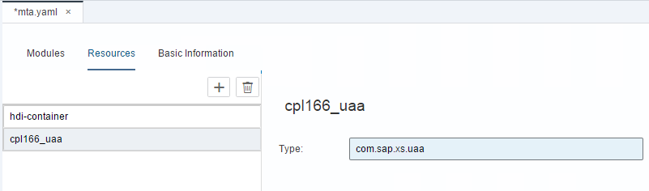

<br>

Next, we define the dependency of the `cpl166ui` and `cpl166js` modules to this resource. This will bind the modules automatically to the UAA service instance.   
Add a new entry in the requires section of both modules:  

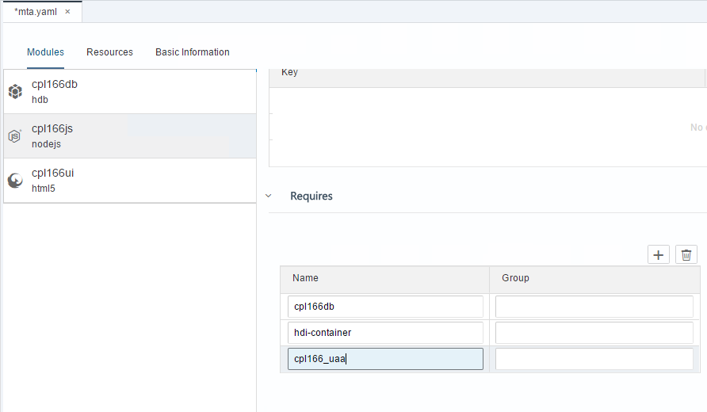
<br>
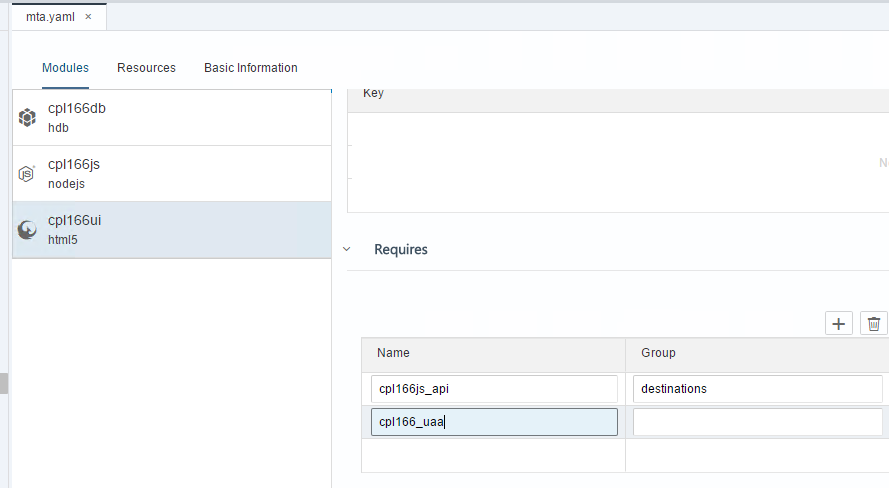

In addition we want the authentication token acquired at runtime by the frontend (cpl166ui) module to be automatically forwarded to the back-end module (`cpl166js`).  
Add an additional property `forwardAuthToken: true` to the destinations property of the `cpl166ui` module in the `mta.yaml`:  

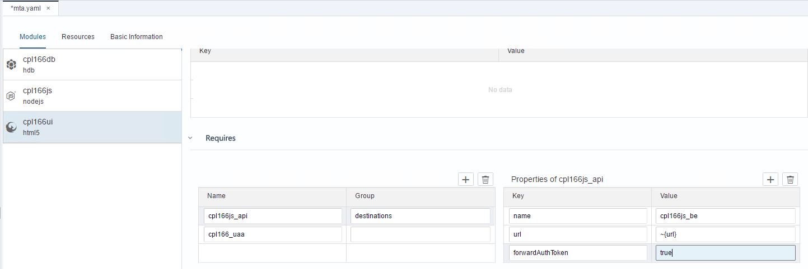
<br>
<hr>
<br>

# Authorization (optional)

Check your timing and rather continue with [Exercise5](../exercise5/README.md).
 
Otherwise your next challenge is to enhance the application with authorization checking code.  
We will introduce two categories of users: those who can only _view_ the country information, and those who are authorized to _add_ new countries.  

## Step 0 - The security concept of XS Advanced
The XS Advanced security concept is based on **scopes**.  
Scopes are functional authorization units in the context of an application, e.g. the permission to create a new country could be encapsulated by a scope called `CreateCountry`.  
Scopes can be assigned to roles which in turn can be assigned to users.   
An application can also define a **role-template** which simplifies the process of creating new roles for administrators.  

With the concept explained, we can now go ahead and enable authorization for our application. This involves the following steps:

1. Define scopes and role-templates in the security configuration file (xs-security.json)
2. Recreate the uaa service instance based on the xs-security.json configuration
3. Add authorization checks in the front- and back-end modules
4. Create roles and role collections from templates and assign them to users

<br>

## Step 1 - Create the xs-security.json file  
The 'xs-security.json' file is a configuration file that defines the scopes used by the application and role-templates that consolidate the scopes into functional roles.  

Create an xs-security.json file in the root folder of your project with the following content.

```
{
	"xsappname": "CPL166MTA",
	"scopes": [
		{
			"name": "$XSAPPNAME.view", 
			"description": "View data" 
		},
		{
			"name": "$XSAPPNAME.create",
			"description": "Create data"
		}
		],
	"role-templates": [
		{
			"name": "cpl166View",
			"description": "Role for viewing data",
			"scope-references": [ "$XSAPPNAME.view"]
			
		},
		{
			"name": "cpl166Create",
			"description": "Role for creating data",
			"scope-references": [ "$XSAPPNAME.create", "$XSAPPNAME.view"]
		}
		]
	
}
```
<br>

The file defines two scopes; one to only _view_ data and another to _create_ data. The scopes are consolidated in two role-templates. Notice that the role-template `tinyworldCreate` includes both scopes to _view_ and _create_ data. Consolidation of multiple scopes should be done on this level, while scopes should always only represent one single privilege.
  
Now we need to update the uaa resource, defined in the `mta.yaml` file, to use the xs-security.json file. To do so, add a new parameter in the resources section. Key is `path` and value is `./xs-security.json`

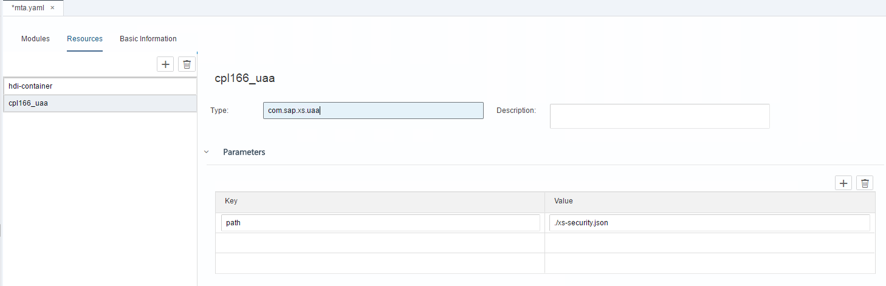

<br>
<hr>
<br>

## Step 2 - Provision the UAA service with xs-security.json
Next we need to update our uaa service instance with the new authorization configuration defined in the xs-security.json file. To do that you first need to download the file from your project in WebIDE to a folder accessible from your command line tool. Right click on xs-security.json and select "Export". The file will now be in your local Downloads folder.


Open a command prompt and navigate to the "Downloads" folder by entering the following cd command and confirming with enter.

```
cd Downloads
```

<br>

Next we need to login to XS Advanced in order to create the uaa service instance. This can be done with the following command (confirm with enter). Enter the credentials and select the space "DEV".

```
xs login -a https://WDFlbmt0749.wdf.sap.corp:30030 --skip-ssl-validation
```

<br>

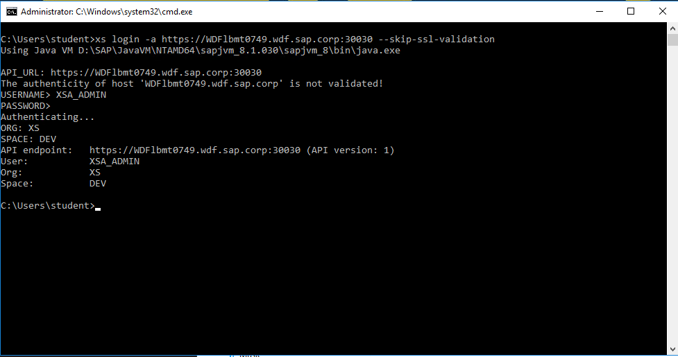

<br> 

If the space "DEV" cannot be selected, change the current targeted space by 

```
xs target -s DEV
```

<br>


Run the following xs command:

```
xs create-service xsuaa devuser cpl166_uaa -c ./xs-security.json

```

<br>


<br>
<hr>
<br>

## Step 3 - Add authorization checks to the application
To enable authorization in App Router based application modules (such as `cpl166ui`), we need to specify the scope a user must be assigned to in order to access the resources of a specific route. The assignment of scopes to routes is done in the xs-app.json file.  

In order to impose authorization checks on any request to our application, we need to add an additional general route, and assign the right scope to it.
Add the following in the mentioned order.

1. Add the view scope to the `/euro.xsodata` in the `cpl166ui/xs-app.json` file so that it looks like in the listing below

```
{
			"source": "^/euro.xsodata/.*$", 
			"destination": "cpl166js_be",
			"scope": "$XSAPPNAME.view"
},
```
<br>

2. Add the create scope to the xsjs route so that it looks like in the listing below

```
{
			"source": ".*\\.xsjs",
			"destination": "cpl166js_be",
			"scope": "$XSAPPNAME.create"
},
```
<br>

3. Add a general route with the view scope assigned to it underneath the other routes

```
{
			"source": "^/(.*)$",
			"localDir": "resources",
			"scope": "$XSAPPNAME.view"
}
```
<br>

In the end the complete `xs-app.json` file should look like this 

```
{
	"welcomeFile": "index.html",
	"authenticationMethod": "route",
	"routes": [
		{
			"source": "^/euro.xsodata/.*$", 
			"destination": "cpl166js_be",
			"scope": "$XSAPPNAME.view"
		},
		{
			"source": ".*\\.xsjs",
			"destination": "cpl166js_be",
			"scope": "$XSAPPNAME.create"
		},
		{
			"source": "^/(.*)$",
			"localDir": "resources",
			"scope": "$XSAPPNAME.view"
		}
		]
}
```
<br>


For the changes to take effect, stop and rerun the `cpl166js` and `cpl166ui` modules. Once you have restarted the modules, the application will become inaccessible since your user has not been assigned the required role collection yet. This will be done in the next step.


<br>
<hr>
<br>

## Step 4 - Create the Roles and assign them to your user

Next we need to create actual roles from the role-template using the __Application Role Builder__, which is part of the XS Advanced Administration Tools.

To open the Administration Tools, we need to find out there url. Therefore open a command prompt and type in the following xs command to switch to the "SAP" space:

```
xs target -s SAP 
```
<br>

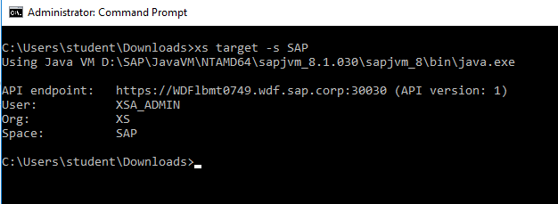

<br>

Then type the following command to show the url:

```
xs app xsa-admin --urls
```

<br>

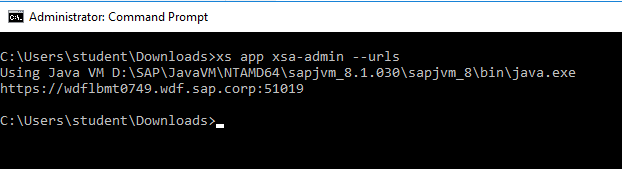

<br>

Copy the url and paste it in the address bar of chrome.
The Administration Tools overview page will open.

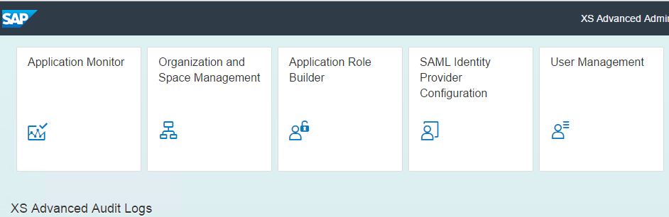

<br>


Navigate to the "Application Role Builder" by clicking on the respective tile. Click on "Configure Role Collections" in the bottom right corner.

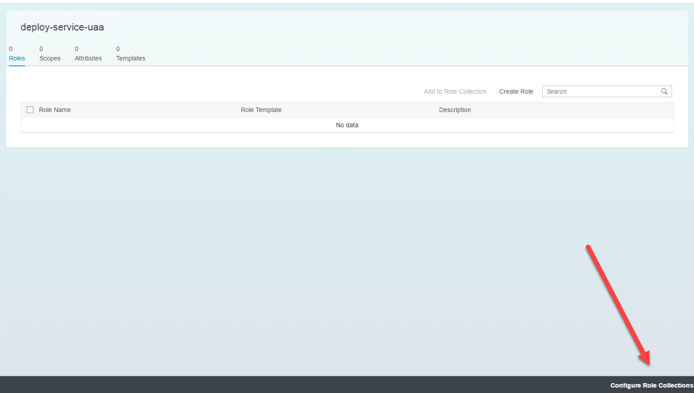

<br>

Create a new role collection by clicking on the `+` icon.


<br>

Enter the name `cpl166_collection` and confirm. Now select  the new created role collection in the list on the left side. A detail view will open on the right side of the screen. Switch to the "Roles" tab.


<br>

Now we will add the two application roles that we have created in the xs-security.json file. Therefore click on "Add application Role". Select our CPL166MTA application from the list. Select the template "cpl166View" and the application role "cpl166View". Do the same for the create template.

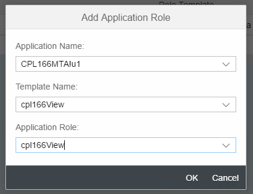

<br>

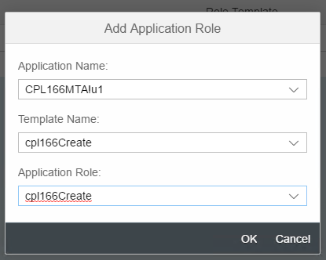

<br>

Save the role collection by clicking on the "Save" button.
Return to the overview page by clicking on the "Home" button in the top left corner. Now open the "User Management" application.
Select the user "XSA_ADMIN".

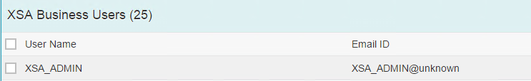

<br>

Switch to the "Role Collections" tab.

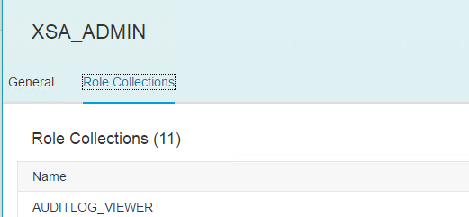

<br>

Click on the "Add" button to add assign a role collection.
Select the new role collection "cpl166_collection" by ticking the checkbox and confirm with ok.

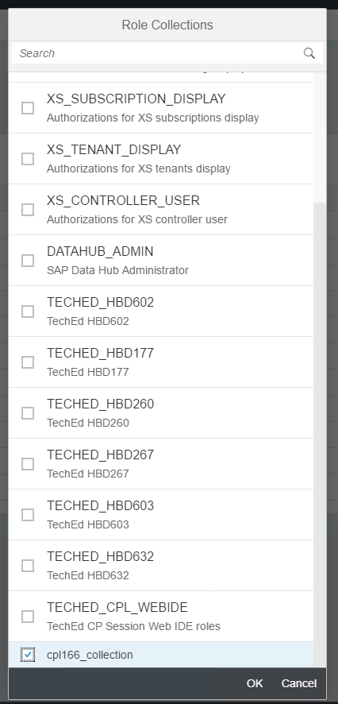

Complete the assignment by clicking on the "Save" button.

Now feel free to test your application. This requires a browser restart or new incognito session!
<br><br>

Continue with [Exercise5](../exercise5/README.md)