# CPL166

In this exercise, we will take the previously developed application and deploy it to SAP Cloud Platform.


## Step 1 - Adjust configuration files
The mta descriptor file and the xs-security configuration require some smaller extension to work within the cloud environment.  

Because of the quota restrictions of the trial account that we are using in this session, we need to set a memory limit for the 'cpl166js' and 'cpl166ui' module. The module 'cpl166db' does not need to be restricted as the type `com.sap.xs.hdi` already includes an implicit memory limit to 256MB.

Open the mta.yaml file in the editor and select 'cpl166js' module. Add a new parameter with the key 'memory' and the value `256M`.

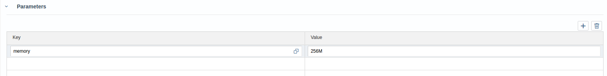
<br>
Add the same parameter for the module 'cpl166ui'.  
  
  Now we need to add some advanced security configuration. Therefore select the module 'cpl166js' and add a property with the key `SAP_JWT_TRUST_ACL` and the value `[{"clientid":"sb-cpl166js", "identityzone": "*"}]`:
  
  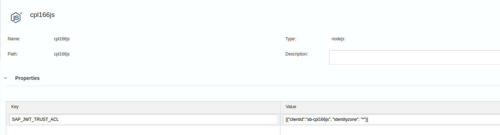
  <br>
  
  Now select the module 'cpl166ui' and add a property with the key 'TENANT_HOST_PATTERN' and the value   
  `^(.*)-trial-dev-cpl166ui.cfapps.eu10.hana.ondemand.com`:
  
  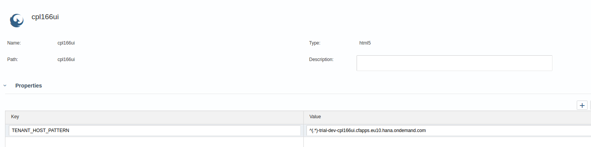
  <br>
  
  Open the xs-security.json file and add a property with the name `tenant-mode` and the value `shared` underneath the `xsappname` property:
  
  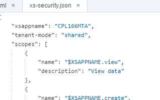
  
  
  <br>
  
  Because the hana service is named `hanatrial` in the trial organization, we need to specify this additional mapping in the mta.yaml. Therefore open the mta.yaml and add an additional parameter to the hdi-container resource with the key `service` and `hanatrial`.
  
  
  
  
  
  <hr>
  <br>
  
## Step 2 - Create the mta archive
For the cloud deployment we need to create an mta archive. Right-click on the project-name 'CPL166MTA' and select 'Build'. Wait for the builder to finish.  

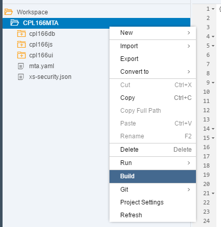

<br>

A new folder called 'mta_archives' has appeared. Unfold it by clicking on the folder. It contains a folder called 'CPL166MTA'. Unfold this folder as well. Inside you will find the newly created mta archive with the name 'cpl166mta_2.0.0.mtar'.  
Export the archive to you local harddisk by right-clicking and selecting 'Export'. This will start the download in the browser.  
  
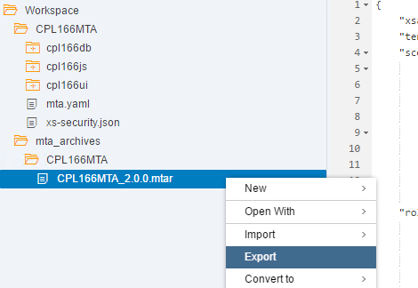
<br>  
<hr>
<br>

## Step 3 - Logon to SAP Cloud Platform Cockpit
Prior to the deployment to SAP Cloud Platform, every user has to register for the Cloud Foundry Trial once.
Open Chrome and navigate to 
https://account.hanatrial.ondemand.com

Login with the user assigned to you.
On the start page of the SAP Cloud Platform Cockpit navigate to the Cloud Foundry Trial by clicking on the respective button ('Start Cloud Foundry Trial').


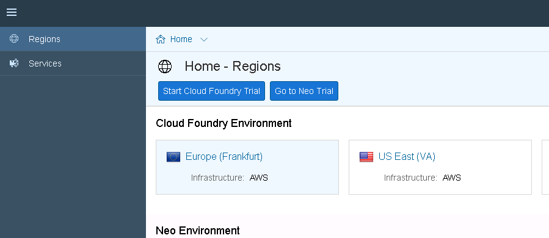
<br>

A popup appears to ask you for the trial landscape. Select 'Europe (Frankfurt)' and confirm with 'Ok'.


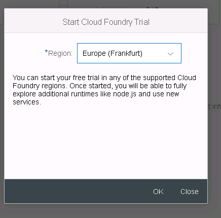
<br>

The progress will be shown in another popup. Wait for all displayed tasks to finish.

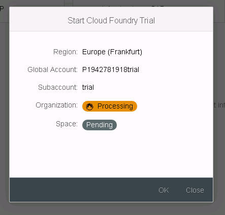
<br>
<hr>
<br>

## Step 4 - Deploy your application to Cloud Foundry
In this step we will deploy our new application to Cloud Foundry. On your Laptop, open the Windows Explorer and navigate to the location where you have downloaded the applications mta archive in Step 2. Usually this is the 'Downloads' folder.  
Open a command window by right-clicking in the Explorer and selecting 'Open Command Window Here'.  


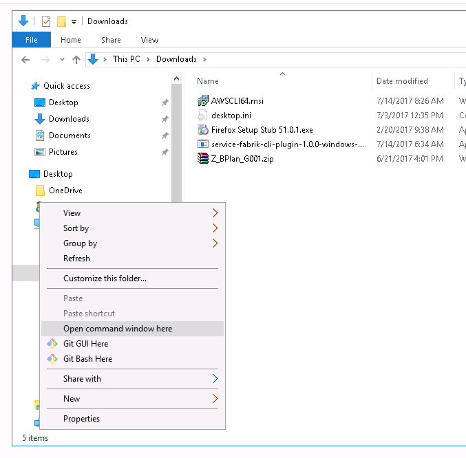
<br>


First we need to set the correct api endpoint of the SAP Cloud Foundry Trial installation. Enter the following command and confirm by pressing enter.

```
cf api https://api.cf.eu10.hana.ondemand.com
```
<br>

After a few seconds, the command will come back with a success message.

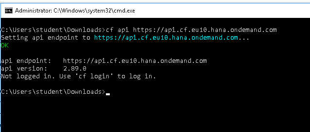
<br>

Now we need to login. Enter the following command and confirm by pressing enter.

```
cf login
```
<br>
The prompt will ask you for your credentials, enter the email and password and confirm each step by pressing enter.

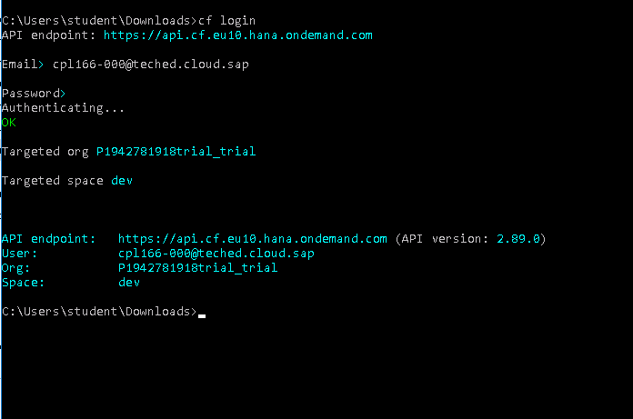
<br>

With the login done, we can start the application deployment. Therefore enter the deploy command as follows and confirm by pressing enter.

```
cf deploy cpl166mta_2.0.0.mtar
```

## Step 5 - Create a Role Collection and assign it to your user (optional - only necessary if corresponding authorization tasks in chapter 4 have been done)
Similar to the previous exercise, we now need to create a role collection and assign it to our user in order to be authorized to access our new application.  

Firstly we need to logon once to our uaa tenant to make our user known. Navigate to the url below. 
You need to replace `<p-username>` with your username. 

```
https://<p-username>trial.authentication.eu10.hana.ondemand.com
```

Login with your credentials and then switch back to the SAP Cloud Platform Cockpit.

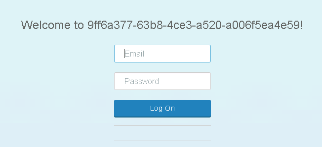
<br>

Open the "Security" menu item and navigate to Role Collections page. Create a new collection called 'cpl166_collection'
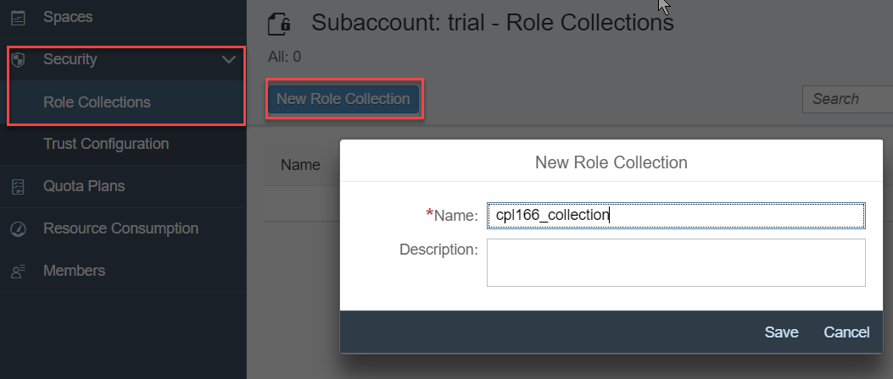
<br>

Navigate to the Trust Configuration page.

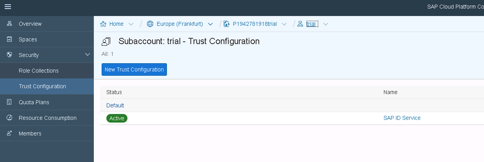
<br>

Click on 'SAP ID Service'. This brings you to another view called 'Role Collection Assignment'.

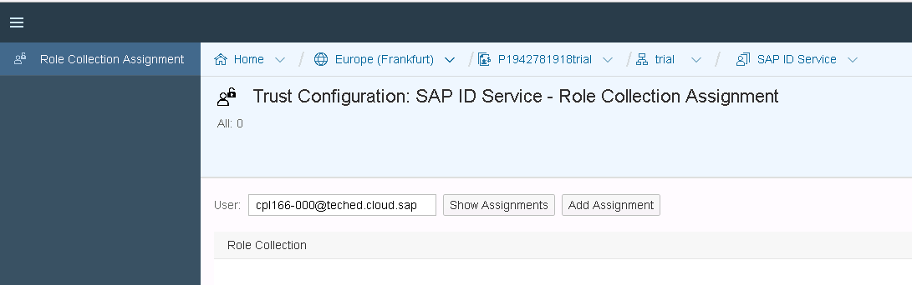
<br>

Enter your username in the search field and click on 'Show Assignments'. This enables the button 'Add Assignment'. Click on the button. In the popup select the previously created role collection and confirm by clicking 'Add Assignment'.

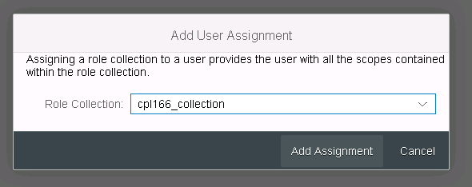
<br>
